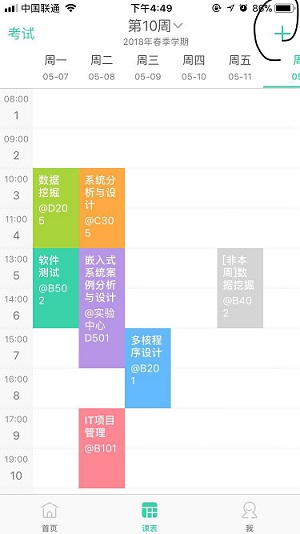
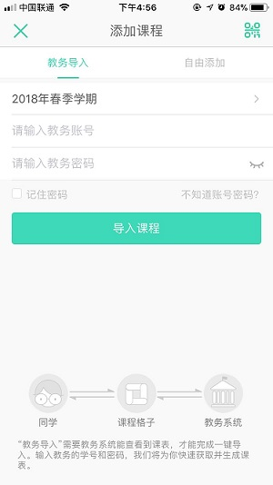
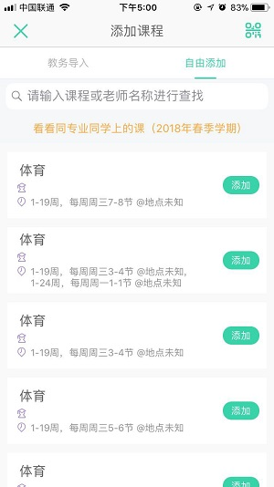
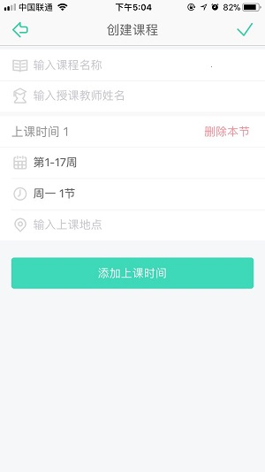
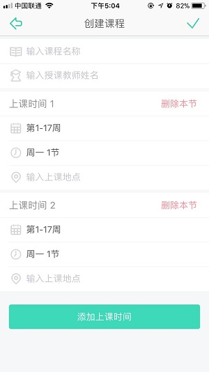
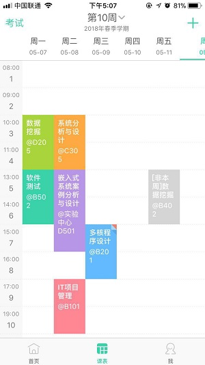

## 课程格子

课程格子是一款基于课程表的移动社交产品，帮助学生朋友们了解课程安排的同时有机会认识一起上课的同学。课程格子首创“课表贴纸”功能，让日程安排更有趣。

除编辑创建课程表外，还可以添加课程笔记、评价老师；和同上一节课或者同院系的同学打招呼、聊天，认识更多新朋友；查看其他学校的课程安排，蹭课更easy；有心事、不高兴、求帮助的时候还有格子BBS，支持匿名发表内容，更多隐私保护。还会提示上课时间、教室与授课教师。

下面对课程格子的添加课程的业务进行说明。

截图1：在课程格子应用完成注册以及个人信息的填写后，可以使用课程格子的添加课程的功能

截图2：可以选择通过教务导入或者是自由添加来导入课程，教务导入需要提供需要导入的学期，教务的学号和密码，并且需要教务系统可以正常接入才能正确获取到课程信息。

截图3：如果无法通过教务导入，则可以通过自由添加功能来添加课程信息。课程格子会根据个人的信息推荐相关的课程，如果在推荐的课程中没有找到需要的课程信息，则可以通过搜索课程名或老师名来加以查找，如果还是没有找到所需课程，可以通过手动创建来进行课程添加。

截图4：手动创建课程表需要输入课程名称，授课教师姓名，选择上课时间，上课地点，如果上课时间不规律，还可以手动添加上课时间。

截图5：课程添加成功后，系统会生成课表。

## 建模要求
* 用例图
* 整个创建课表业务或用例的活动图
* 针对整个业务流程领域模型
* 自选对象的状态图
* 创建课表场景的系统顺序图与操作协议
