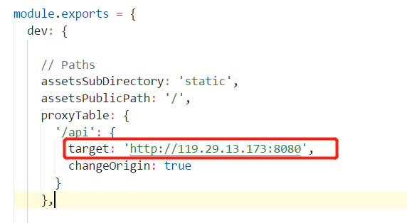
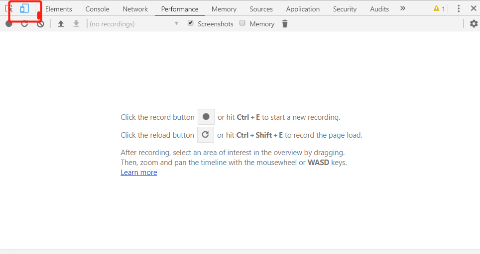

# 安装部署说明

## 1. Front end

1.1 从Github上Clone项目

```
git clone 'https://github.com/SYSU-BronzeTiki/BronzeTiki-FE.git'

```

1.2 设置后台部署所提供的IP，如 http://119.29.13.173:8080，打开文件"/BronzeTiki-FE/config/index.js"，将下图中的target字段替换为相应的IP。



1.3 在项目根目录'/BronzeTiki-FE'下，安装项目依赖项

```
npm install

```

1.4 运行前端项目

```
npm run start

```
1.5 在Chrome浏览器打开 http://locahost:8080，按F12，点击调试界面左上角切换至移动端模式。



## 2. Back End

