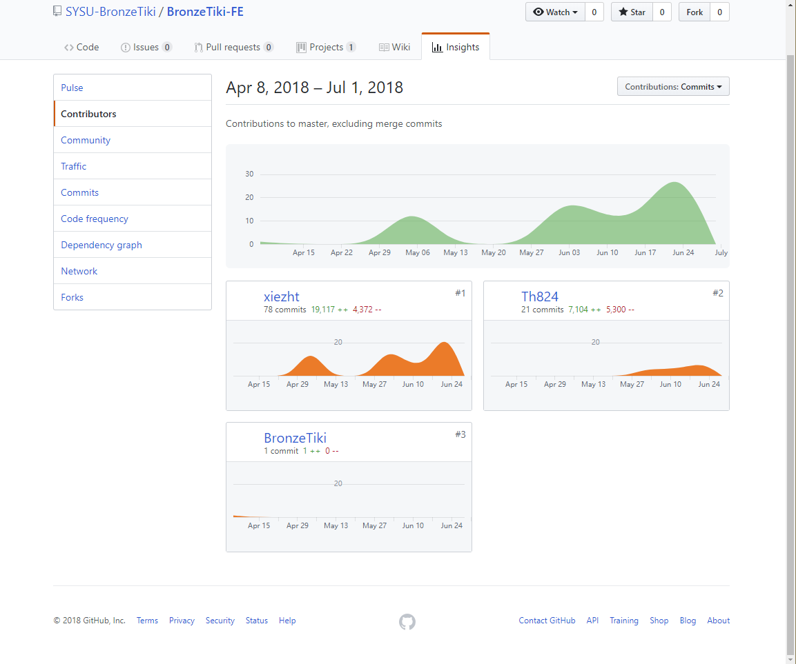

# Final-Report

## 课程学习总结

这学期的系统分析与设计，了解到了一个软件的开发流程，同时，理论课和项目一起进行，使得理论知识有了验证的机会，深刻体会到了系统的开发流程对于项目成功的关键性。但是，也因为没有能够很好地落实书本上的知识以及应用新兴的技术手段，使得项目的完成困难重重，踩坑无数。算是体验了一次微型的"软件危机"

同时，也认识到了团队建设的重要性，因为和队友没有很好的沟通，导致任务的进度不统一，给开发造成了困难，也认识到了管理技能在一个系统的开发流程中的重要作用。

## PSP 2.1

| PSP2.1                                 | Time |
| -------------------------------------- | ---- |
| Planing                                | 3    |
| -Estimate                              | 3    |
| Development                            | 70   |
| -Analysis                              | 10   |
| -Design Review                         | 5    |
| -Coding Stardard                       | 5    |
| -Design                                | 25   |
| -Coding                                | 25   |
| -Code Review                           | 0    |
| -Test                                  | 10   |
| Reposting                              | 2    |
| -Test Report                           | 3    |
| -Size Measurement                      | 2    |
| -Postmortem & Process Improvement Plan | 2    |
| sum                                    | 165  |

## 个人分支的git报告

## 自认为最得意/或有价值/或有苦劳的工作清单

* 先于队友踩坑然后减少队友爬坑的时间
* 调动队友开发，加强团队建设
