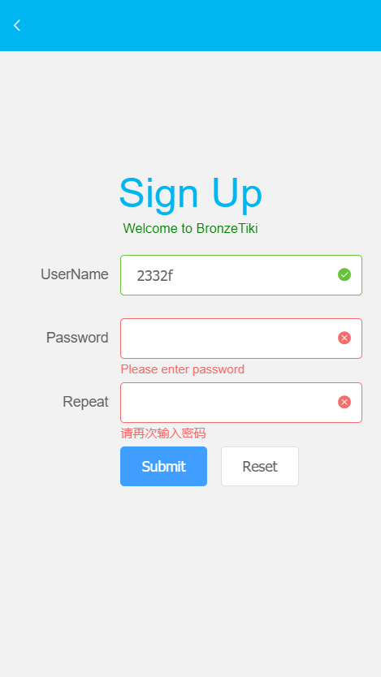
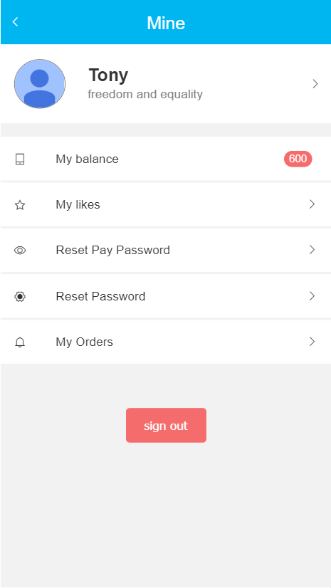
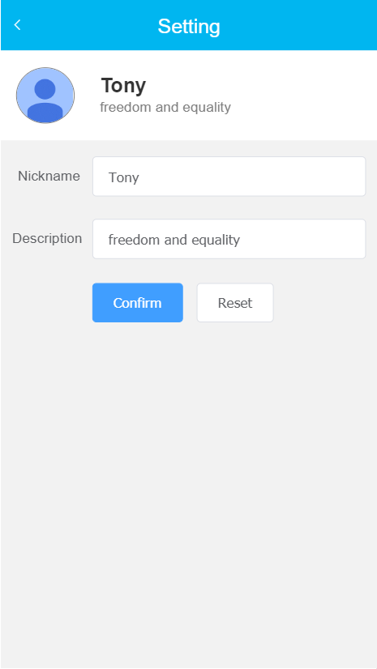
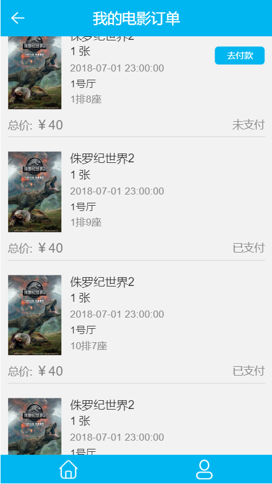
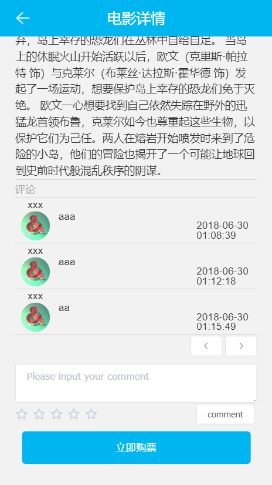
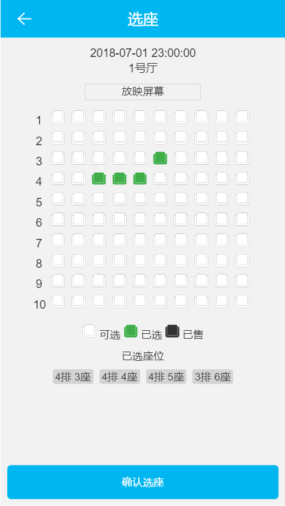

# BronzeTiki 用户手册

## 1. 系统简介

### 1.1 系统用户

本系统面向观影爱好者，为其提供网上在线购票平台，查询电影信息，分享个人观影感受。

### 1.2 运行环境

用户可以通过手机浏览器、或者PC端chrome浏览器（切换至移动端访问模式）访问http://119.29.13.173:8080网站来使用该购票系统。

## 2. 系统使用

### 2.1 用户注册

新用户需要先进行注册再登录才可以进行购票。需要填写用户名、密码。用户名为3-10字母/数字/下划线的组合。密码为数字和字母的组合。
填写后系统会验证用户名和密码合法性。点击submit按钮提交表单，reset按钮重置所有输入。

### 2.2 用户登录

用户登录后方可进行购票。在登录界面输入已注册用户名和密码。系统验证成功后进入个人页面。

### 2.3 个人中心

用户可以在个人中心页面查看个人基本信息。

#### 2.3.1 修改个人信息

点击头像信息栏，进入个人信息修改页面。点击头像可以自行上传头像图片。在页面修改昵称和个人简介完成后点击submit提交。reset重置所有输入。

#### 2.3.2 重置个人密码

点击"Reset Pay Password"栏可以修改个人支付密码。用户初始支付密码为123456，请用户注册后自行修改密码。

点击"Reset Password"栏可以修改个人登录密码。

#### 2.3.3 查看个人订单列表

点击"My Orders"栏可以查看用户的订单记录。订单列表显示订单的当前状态。点击"去付款"跳转至对应的订单支付页面。

### 2.4 电影列表

首页显示电影列表及其上映状态。显示"可预订"状态的电影条目可以选择相应场次座次进行购票。
点击对应电影条目进入电影详情页面。

### 2.5 电影详情

用户可以在本页面查看电影条目的基本信息。

用户可在该页面对电影进行评论，分享个人对电影的感受。

如果电影当前有档期，可以在页面底部选择"立即购票"进入"场次选择"页面。

### 2.6 场次选择

页面显示电影最近三天的上映场次。用户可以选择合适时间的场次，进入相应场次的座次选择。

### 2.7 座次选择

选择场次后，进入座次选择页面。用户可以选择座位表上的空座位，做多可以选择4个座位，选择"确认选座"生成订单。座位预订成功则跳转至订单支付页面。

### 2.8 订单支付

用户确认订单信息无误后，点击"确认支付"按钮，输入正确的支付密码，若支付成功，跳转至订单列表页面。

