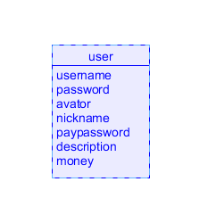
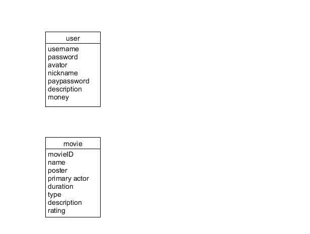
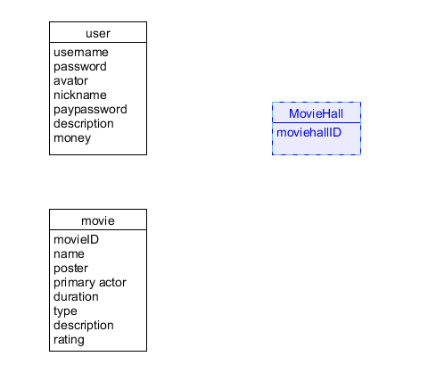
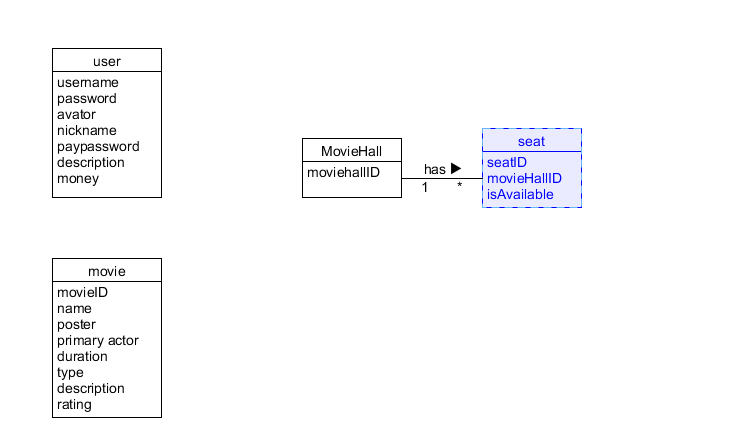
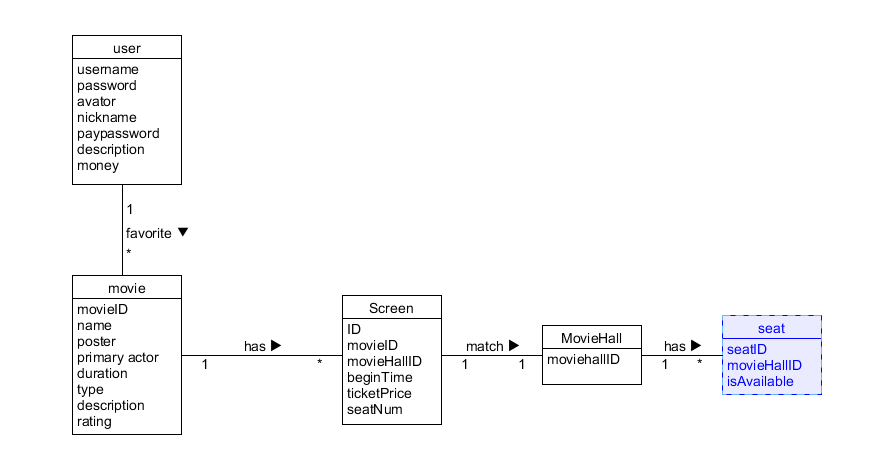
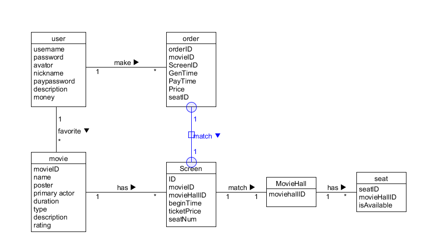

# 领域建模

通过用例文本查找出该领域中的概念类，进行领域建模。概念类如下：

* 用户
* 电影
* 电影厅
* 座位
* 场次
* 订单
* 评论

## 用户

用户是该领域中的第一个概念类，用户的属性包括：用户名，账号密码，头像，昵称，支付密码，个人描述，账户余额。

## 电影

用例中描述，用户可以通过搜索或者主页推荐了解到一部电影，电影需要包括的属性有：电影ID，电影名，海报，主演，电影时长，电影类型，电影的简介，电影的用户评分

## 电影厅

一个影院中有多个电影厅，一个电影厅在某个场次播放某部电影，电影厅只需要一个ID标志

## 座位

座位表示的是具体某个电影厅的某个行，某个列的座位，该座位是否被预订了，一个电影厅可以有多个座位。

## 场次

每部电影的排片都不同，一部电影只在特定的场次（即时间，地点（电影厅））播放，一个特定的场次则只能有一部电影播放。因此，场次作为一个概念类需要有的属性有：该场次的ID，电影ID，时间，地点（电影厅ID），该场次的价格，座位的数量。

## 订单

订单应该包括订单ID（唯一确定一张订单），订单生成的时间，订单的金额，订单支付的时间，选定的座位号，电影的ID，场次的ID。一个用户可以下多个订单，一个订单对应一部电影，一个订单也对应一个场次。

## 评论

评论作为一个概念类，需要包含的属性有：评论者，评论的时间，评论的内容，评论的点赞数，一个用户可以发表多个评论，一部电影也可以有多个评论。

